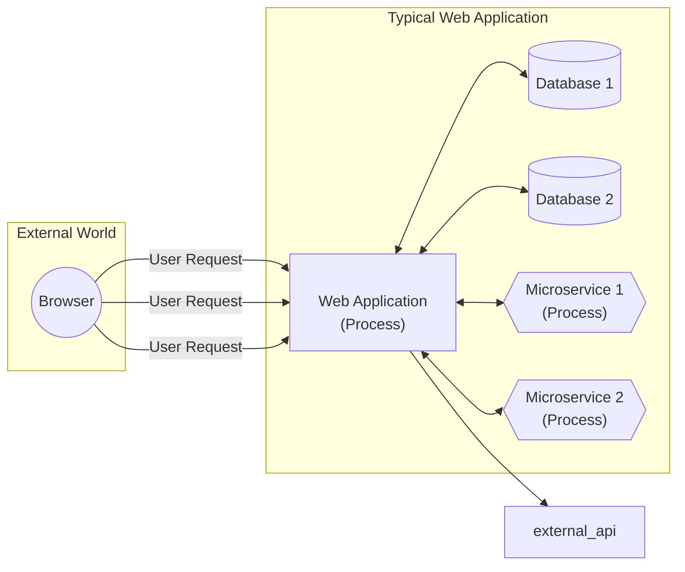
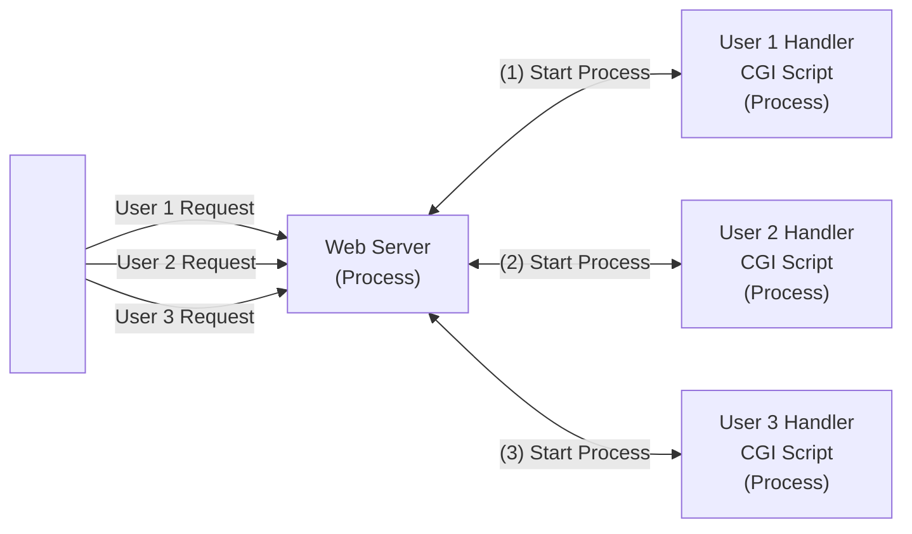
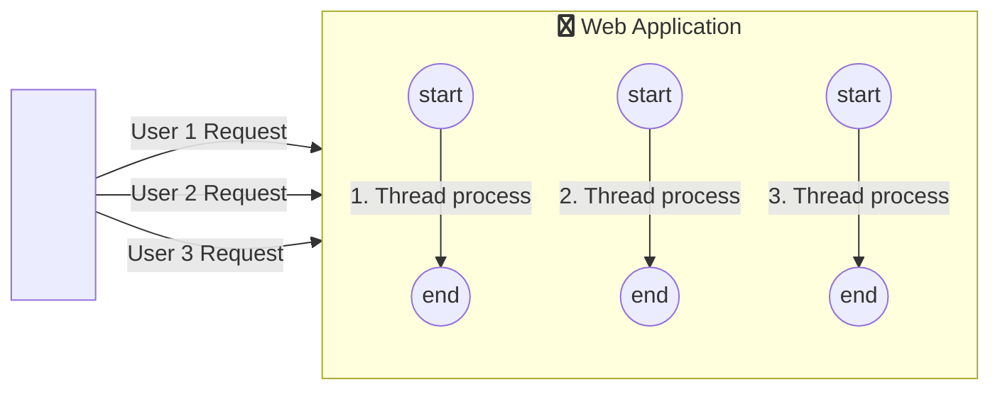
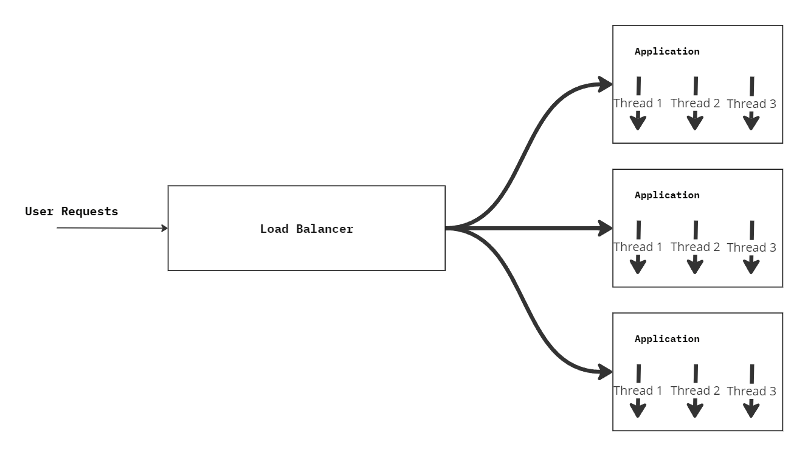
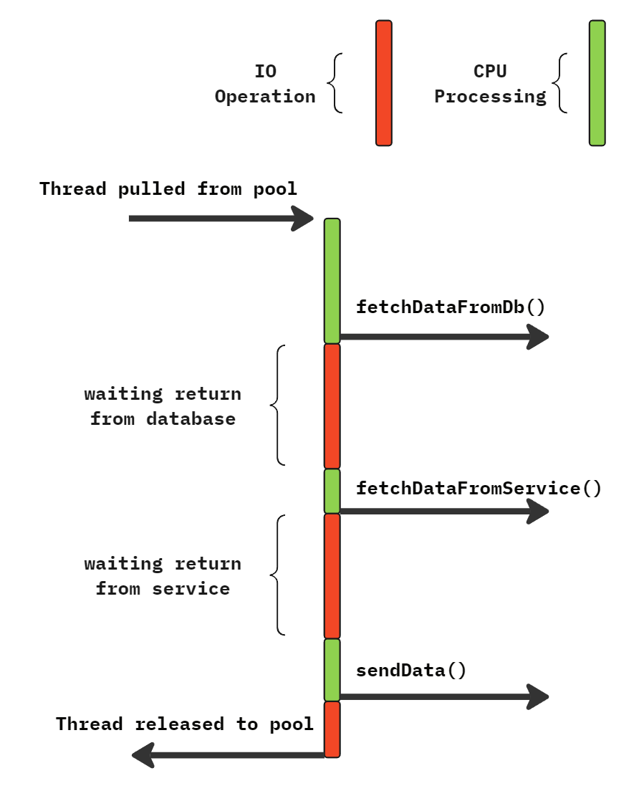
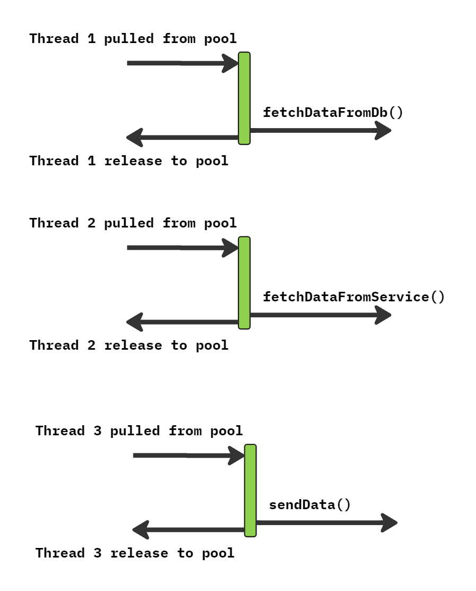

<head>
  <link href="https://cdnjs.cloudflare.com/ajax/libs/font-awesome/6.5.1/css/all.min.css" rel="stylesheet" />
</head>

# Java 21 Virtual Threads and Structured Concurrency

## Java Threads and Scalability

* Task types
* Concurrency and Parallelism
* Non Blocking IO
* Introduce Project Loom

### Task Types



### Process Per Request (CGI)



* Process is heavyweight
* Limited number of processes per machine
  * Scalability issues
  * Cannot support large number of users
* Expensive Process startup and termination time
* Difficult to share data or communicate between Processes
* FastCGI
  * Pooling of Processes
  * CGI processes are started upfront for performance

### Thread Per Request



* Threads are lightweight
  * But has its own stack
* Can handle larger number of concurrent users
* Can share data or communicate between threads
* Improved Performance
  * No extra process to deal with
* Easy to understand
* Easy to debug

### Concurrency and Parallelism

#### Concurrency

* Multiple independent tasks are making progress but may not execute at the *same* time
* Appearance of simultaneous execution (parallelism)
* Concurrency is about dealing with lots of things at once
* CPU time slicing

#### Parallelism

* Multiple dependent sub-tasks are executing at the *same* time
* Multiple cores needed
* No parallelism in single core

#### Synchronous Call

* Sequential execution of code
* Easy to understand
* Easy to debug

#### Asynchronous Call

* Does not wait for call to complete
* Callbacks, Futures...
* More complex to understand
* In java, user Threads

## Threads and Scalability

* Default stack size 1M
  * As number of users increase, memory usage increases
* There is a max limit to the max threads
  * Depends on VM or Machine Memory
  * Much more socket connections can be supported
  * This prevents optimum scalability
* IO Bound Tasks
  * Paralyzes the OS thread for a longer time than necessary

## Scalability Solutions

* `{Optimized Scalable Application}` + `{Vertial Scaling}` + `{Horizontal Scaling}`

### Vertical Scaling

* Increase resources
* CPU, Memory, Disk Space, etc...
* Limit to scaling
* Increases cost
* Cloud Environment

### Horizontal Scaling

* Increase number of Application (Instances) nodes
* No limit
* Costly



## Non Blocking IO

* Pseudo Code For Blocking IO

### Blocking IO program flux

```java
// Fetch some data from DB
var data1 = fetchDataFromDB(dbUrl);

// Fetch some data from Microservice
var data2 = fetchDataFromService(serviceUrl);

// Process all data
var combinedData = processAndCombine(data1, data2);

// Send data to user
sendData(combinedData);
```



### Non-Blocking IO program flux



```java

// Non Blocking: Fetch some data from DB
return fetchDataFromDb(dbUrl, data1 -> {
    // Non Blocking: Fetch some data from Microservice
    return fetchDataFromService(serviceUrl, data2 -> {
        // Process all data and send
        var combinedData = processAndCombine(data1, data2);
        return sendData(combinedData);
    });
});

```

## Virtual Threads

* Lightweight threads (Extends the Thread Class)
  * Fast creation time
  * Exhibits same behaviour as Platform Threads
  * Scales to millions of instances

### Advantages
  * No need for Thread Pool
  * Can block on IO with no scalability issues
  * Optimal concurrency
  * Code can still be sequential
  * Existing code will benefit from using Virtual Thread
  * Combine with Future's and CompletableFuture's 
### Limitations
  * Blocking with native frames on Stack (JNI)
    * This is rare
  * Control memory per stack
    * Reduce ThreadLocal's usage
    * No deep recursions


